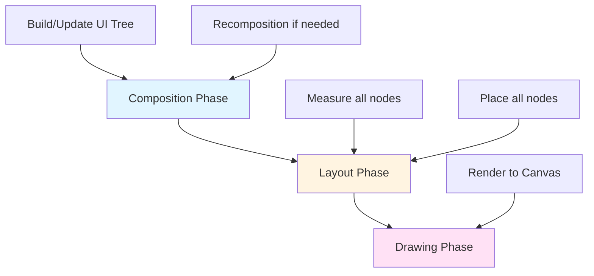
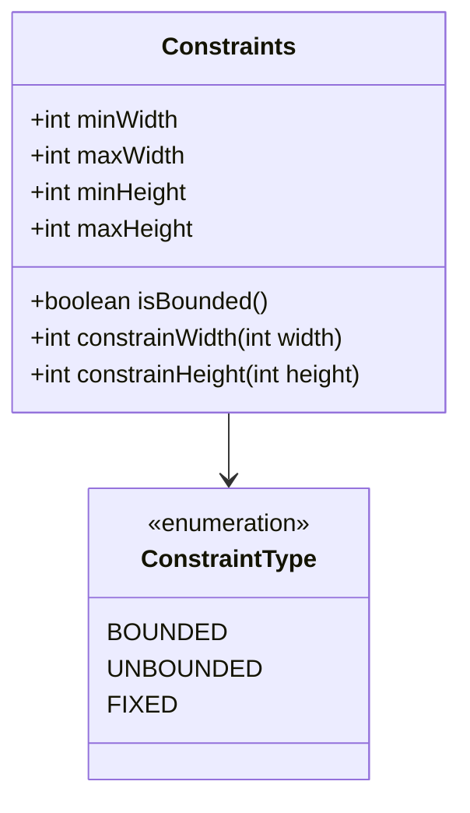
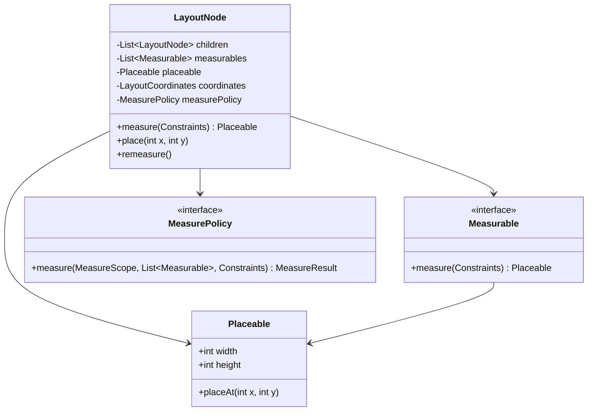
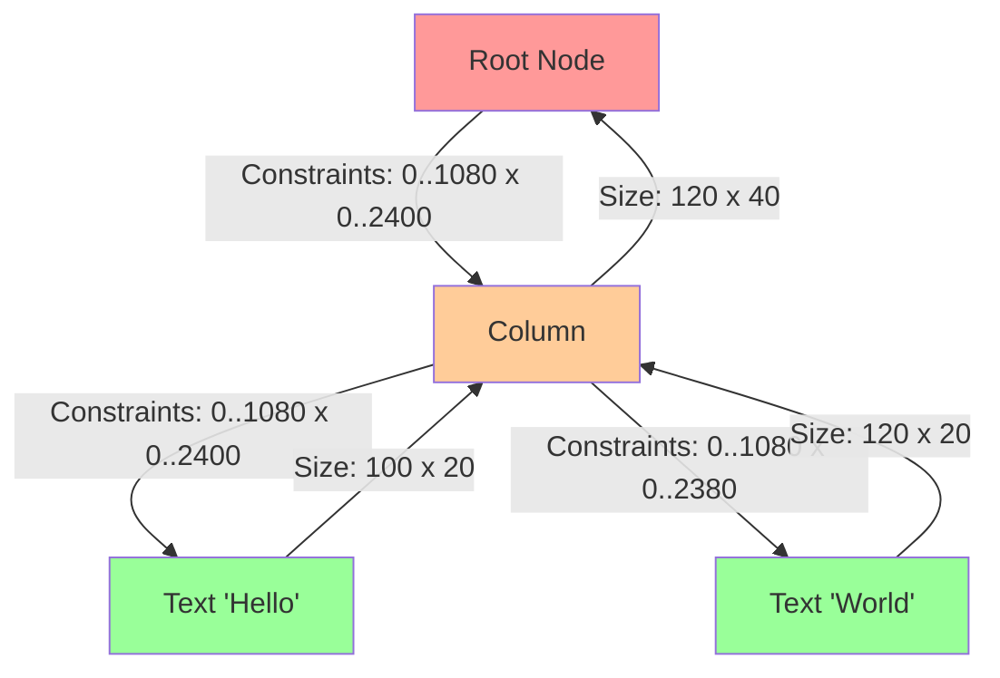
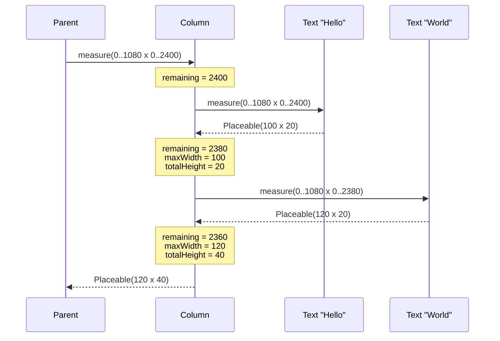
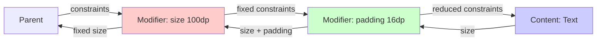
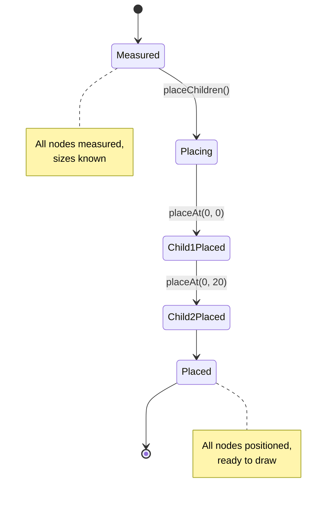
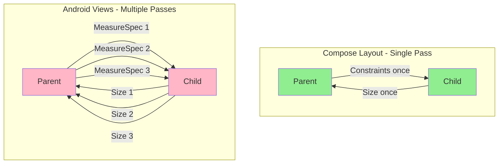

# Jetpack Compose Layout Engine Internals

## Table of Contents

1. [Introduction](#introduction)
2. [Core Principles](#core-principles)
3. [The Three-Phase System](#the-three-phase-system)
4. [Constraint Model](#constraint-model)
5. [Layout Node Architecture](#layout-node-architecture)
6. [The Measurement Algorithm](#the-measurement-algorithm)
   - 6.1 [Measurement Flow](#measurement-flow)
   - 6.2 [Single-Pass Guarantee](#single-pass-guarantee)
7. [Layout Implementations](#layout-implementations)
   - 7.1 [Column Layout](#column-layout)
   - 7.2 [Row Layout](#row-layout)
   - 7.3 [Box Layout](#box-layout)
8. [Complete Example Walkthrough](#complete-example-walkthrough)
9. [Modifier Chain Processing](#modifier-chain-processing)
10. [Placement Phase](#placement-phase)
11. [Performance Characteristics](#performance-characteristics)
12. [Comparison with Android Views](#comparison-with-android-views)

---

## Introduction

Jetpack Compose uses a **constraint-based, single-pass layout system** fundamentally different from the traditional Android View system. The core philosophy can be summarized as:

> **"Measure children once. Constraints flow down, sizes flow up."**

This document explores the internal mechanics of how the Compose layout engine determines where and how to render UI elements on screen.

---

## Core Principles

The Compose layout engine is built on several foundational principles:

1. **Single-Pass Measurement**: Each node is measured exactly once per frame
2. **Constraint Propagation**: Parents constrain children, not the reverse
3. **Size Aggregation**: Children report their sizes back to parents
4. **Separation of Concerns**: Measurement and placement are separate phases
5. **No Backtracking**: Once measured, a node's size is final

---

## The Three-Phase System

Every frame in Compose goes through three distinct phases:



**Focus Area**: This document focuses on the **Layout Phase** (measurement and placement).

---

## Constraint Model

Constraints define the minimum and maximum dimensions a node can occupy.



### Java Implementation

```java
public class Constraints {
    public final int minWidth;
    public final int maxWidth;
    public final int minHeight;
    public final int maxHeight;
    
    public static final int INFINITY = Integer.MAX_VALUE;
    
    public Constraints(int minWidth, int maxWidth, int minHeight, int maxHeight) {
        this.minWidth = minWidth;
        this.maxWidth = maxWidth;
        this.minHeight = minHeight;
        this.maxHeight = maxHeight;
        
        // Validate constraints
        assert minWidth >= 0 && minWidth <= maxWidth;
        assert minHeight >= 0 && minHeight <= maxHeight;
    }
    
    /**
     * Check if constraints have finite maximum dimensions
     */
    public boolean isBounded() {
        return maxWidth != INFINITY && maxHeight != INFINITY;
    }
    
    /**
     * Clamp a width value to satisfy these constraints
     */
    public int constrainWidth(int width) {
        return Math.max(minWidth, Math.min(width, maxWidth));
    }
    
    /**
     * Clamp a height value to satisfy these constraints
     */
    public int constrainHeight(int height) {
        return Math.max(minHeight, Math.min(height, maxHeight));
    }
    
    /**
     * Create constraints with fixed dimensions
     */
    public static Constraints fixed(int width, int height) {
        return new Constraints(width, width, height, height);
    }
    
    /**
     * Create constraints that allow any size within bounds
     */
    public static Constraints bounded(int maxWidth, int maxHeight) {
        return new Constraints(0, maxWidth, 0, maxHeight);
    }
}
```

---

## Layout Node Architecture

Every composable that participates in layout has an associated `LayoutNode`.



### Java Implementation

```java
public abstract class LayoutNode {
    protected List<LayoutNode> children = new ArrayList<>();
    protected List<Measurable> measurables = new ArrayList<>();
    protected Placeable placeable;
    protected LayoutCoordinates coordinates;
    protected MeasurePolicy measurePolicy;
    
    /**
     * Measure this node with given constraints.
     * Called by parent during layout pass.
     */
    public abstract Placeable measure(Constraints constraints);
    
    /**
     * Place this node at specified coordinates.
     * Called by parent during placement pass.
     */
    public void place(int x, int y) {
        this.coordinates = new LayoutCoordinates(x, y);
    }
    
    /**
     * Add a child to this layout node
     */
    public void addChild(LayoutNode child) {
        children.add(child);
        measurables.add(child.asMeasurable());
    }
    
    protected Measurable asMeasurable() {
        return new Measurable() {
            @Override
            public Placeable measure(Constraints constraints) {
                return LayoutNode.this.measure(constraints);
            }
        };
    }
}

/**
 * Represents a child that can be measured
 */
public interface Measurable {
    Placeable measure(Constraints constraints);
}

/**
 * Result of measuring a node - contains size and placement logic
 */
public class Placeable {
    public final int width;
    public final int height;
    private final PlacementScope placementScope;
    private boolean isPlaced = false;
    
    public Placeable(int width, int height, PlacementScope placementScope) {
        this.width = width;
        this.height = height;
        this.placementScope = placementScope;
    }
    
    /**
     * Place this measured element at the given position
     */
    public void placeAt(int x, int y) {
        if (isPlaced) {
            throw new IllegalStateException("Cannot place element twice!");
        }
        isPlaced = true;
        placementScope.place(x, y);
    }
}

/**
 * Scope for placing measured children
 */
public interface PlacementScope {
    void place(int x, int y);
}
```

---

## The Measurement Algorithm

### Measurement Flow

The layout engine performs a depth-first traversal of the layout tree:



### Core Algorithm

```java
public class LayoutEngine {
    
    /**
     * Entry point for layout pass.
     * Measures entire tree starting from root.
     */
    public Placeable measureTree(LayoutNode root, Constraints rootConstraints) {
        // Phase 1: Measurement (recursive, top-down)
        Placeable rootPlaceable = measureNode(root, rootConstraints);
        
        // Phase 2: Placement (recursive, top-down)
        placeNode(rootPlaceable, 0, 0);
        
        return rootPlaceable;
    }
    
    /**
     * Recursively measure a node and its children.
     * This is called ONCE per node per frame.
     */
    private Placeable measureNode(LayoutNode node, Constraints constraints) {
        // Dispatch to appropriate measurement strategy
        MeasurePolicy policy = node.getMeasurePolicy();
        
        // Create measure scope with density, font scale, etc.
        MeasureScope scope = new MeasureScope(node.getDensity(), node.getFontScale());
        
        // Execute measurement policy
        MeasureResult result = policy.measure(scope, node.getMeasurables(), constraints);
        
        // Validate result respects constraints
        validateMeasurementResult(result, constraints);
        
        return result.toPlaceable();
    }
    
    /**
     * Recursively place measured nodes
     */
    private void placeNode(Placeable placeable, int x, int y) {
        placeable.placeAt(x, y);
    }
    
    /**
     * Ensure measurement result respects parent constraints
     */
    private void validateMeasurementResult(MeasureResult result, Constraints constraints) {
        int width = result.getWidth();
        int height = result.getHeight();
        
        if (width < constraints.minWidth || width > constraints.maxWidth) {
            throw new IllegalStateException(
                "Width " + width + " violates constraints [" + 
                constraints.minWidth + ", " + constraints.maxWidth + "]"
            );
        }
        
        if (height < constraints.minHeight || height > constraints.maxHeight) {
            throw new IllegalStateException(
                "Height " + height + " violates constraints [" + 
                constraints.minHeight + ", " + constraints.maxHeight + "]"
            );
        }
    }
}
```

### Single-Pass Guarantee

The engine enforces measurement invariants to ensure O(n) complexity:

```java
public class MeasurementPolicy {
    
    /**
     * Measure a child with constraints.
     * Enforces single-measurement rule.
     */
    protected Placeable measureChild(Measurable child, Constraints constraints) {
        // RULE 1: Each child measured exactly once
        if (child.hasBeenMeasured()) {
            throw new IllegalStateException(
                "Cannot measure child twice! This violates the single-pass guarantee."
            );
        }
        
        child.markAsMeasured();
        Placeable result = child.measure(constraints);
        
        // RULE 2: Child must respect constraints
        validateChildSize(result, constraints);
        
        return result;
    }
    
    /**
     * Place a measured child.
     * Enforces placement rules.
     */
    protected void placeChild(Placeable placeable, int x, int y) {
        // RULE 3: Must measure before placing
        if (!placeable.isMeasured()) {
            throw new IllegalStateException(
                "Cannot place unmeasured child!"
            );
        }
        
        // RULE 4: Each child placed exactly once
        if (placeable.isPlaced()) {
            throw new IllegalStateException(
                "Cannot place child twice!"
            );
        }
        
        placeable.placeAt(x, y);
    }
    
    private void validateChildSize(Placeable placeable, Constraints constraints) {
        if (placeable.width < constraints.minWidth || 
            placeable.width > constraints.maxWidth ||
            placeable.height < constraints.minHeight || 
            placeable.height > constraints.maxHeight) {
            throw new IllegalStateException("Child violated constraints!");
        }
    }
}
```

---

## Layout Implementations

### Column Layout

Stacks children vertically, dividing available height sequentially.



#### Java Implementation

```java
public class ColumnMeasurePolicy implements MeasurePolicy {
    
    @Override
    public MeasureResult measure(
        MeasureScope scope,
        List<Measurable> measurables,
        Constraints constraints
    ) {
        // Track measurement state
        int remainingHeight = constraints.maxHeight;
        int maxWidth = 0;
        int totalHeight = 0;
        
        // Store measured children for placement phase
        List<Placeable> placeables = new ArrayList<>();
        
        // MEASUREMENT PHASE: Measure each child top-to-bottom
        for (Measurable child : measurables) {
            // Create constraints for this child
            // Width: inherit from parent
            // Height: whatever space remains
            Constraints childConstraints = new Constraints(
                constraints.minWidth,
                constraints.maxWidth,
                0, // min height: flexible
                Math.max(0, remainingHeight) // max height: what's left
            );
            
            // RECURSIVE CALL: Measure child (constraints flow DOWN)
            Placeable placeable = child.measure(childConstraints);
            placeables.add(placeable);
            
            // ACCUMULATE: Sizes flow UP
            totalHeight += placeable.height;
            maxWidth = Math.max(maxWidth, placeable.width);
            remainingHeight -= placeable.height;
        }
        
        // Determine final size within constraints
        final int finalWidth = constraints.constrainWidth(maxWidth);
        final int finalHeight = constraints.constrainHeight(totalHeight);
        
        // Return measure result with placement logic
        return new MeasureResult(finalWidth, finalHeight) {
            @Override
            public void placeChildren(PlacementScope scope) {
                int yPosition = 0;
                
                // Place children vertically
                for (Placeable placeable : placeables) {
                    placeable.placeAt(0, yPosition);
                    yPosition += placeable.height;
                }
            }
        };
    }
}
```

### Row Layout

Stacks children horizontally, dividing available width sequentially.

```java
public class RowMeasurePolicy implements MeasurePolicy {
    
    @Override
    public MeasureResult measure(
        MeasureScope scope,
        List<Measurable> measurables,
        Constraints constraints
    ) {
        int remainingWidth = constraints.maxWidth;
        int maxHeight = 0;
        int totalWidth = 0;
        
        List<Placeable> placeables = new ArrayList<>();
        
        // Measure each child left-to-right
        for (Measurable child : measurables) {
            Constraints childConstraints = new Constraints(
                0, Math.max(0, remainingWidth),  // width: what's left
                constraints.minHeight,
                constraints.maxHeight            // height: inherit
            );
            
            Placeable placeable = child.measure(childConstraints);
            placeables.add(placeable);
            
            totalWidth += placeable.width;
            maxHeight = Math.max(maxHeight, placeable.height);
            remainingWidth -= placeable.width;
        }
        
        final int finalWidth = constraints.constrainWidth(totalWidth);
        final int finalHeight = constraints.constrainHeight(maxHeight);
        
        return new MeasureResult(finalWidth, finalHeight) {
            @Override
            public void placeChildren(PlacementScope scope) {
                int xPosition = 0;
                
                for (Placeable placeable : placeables) {
                    placeable.placeAt(xPosition, 0);
                    xPosition += placeable.width;
                }
            }
        };
    }
}
```

### Box Layout

Measures all children with same constraints, then overlays them.

```java
public class BoxMeasurePolicy implements MeasurePolicy {
    
    @Override
    public MeasureResult measure(
        MeasureScope scope,
        List<Measurable> measurables,
        Constraints constraints
    ) {
        List<Placeable> placeables = new ArrayList<>();
        
        // Box size starts at minimum constraints
        int boxWidth = constraints.minWidth;
        int boxHeight = constraints.minHeight;
        
        // ALL children get the SAME constraints
        // (unlike Column which divides space)
        for (Measurable child : measurables) {
            // Each child measured with full parent constraints
            Placeable placeable = child.measure(constraints);
            placeables.add(placeable);
            
            // Box expands to fit largest child
            boxWidth = Math.max(boxWidth, placeable.width);
            boxHeight = Math.max(boxHeight, placeable.height);
        }
        
        final int finalWidth = constraints.constrainWidth(boxWidth);
        final int finalHeight = constraints.constrainHeight(boxHeight);
        
        return new MeasureResult(finalWidth, finalHeight) {
            @Override
            public void placeChildren(PlacementScope scope) {
                // All children placed at origin (overlaid)
                // Alignment logic would adjust position here
                for (Placeable placeable : placeables) {
                    placeable.placeAt(0, 0);
                }
            }
        };
    }
}
```

---

## Complete Example Walkthrough

Let's trace through a complete measurement and placement cycle.

### Compose Code

```kotlin
Column {
    Text("Hello")   // Measures to 100x20
    Text("World!")  // Measures to 120x20
}
```

### Execution Trace

```java
public class LayoutTraceExample {
    
    public static void traceLayout() {
        // STEP 1: Root starts with screen constraints
        Constraints screenConstraints = new Constraints(
            0, 1080,  // width: 0..1080
            0, 2400   // height: 0..2400
        );
        
        System.out.println("=== MEASUREMENT PHASE ===");
        
        // STEP 2: Column.measure() invoked
        System.out.println("\n[Column] Received constraints: " + screenConstraints);
        
        // STEP 3: Column measures first child
        Constraints text1Constraints = new Constraints(0, 1080, 0, 2400);
        System.out.println("[Column] Measuring child 1 with: " + text1Constraints);
        
        Placeable text1 = measureText("Hello", text1Constraints);
        System.out.println("[Text1] Measured size: " + text1.width + "x" + text1.height);
        // Output: 100x20
        
        int remainingHeight = 2400 - 20;  // = 2380
        int maxWidth = 100;
        int totalHeight = 20;
        
        // STEP 4: Column measures second child with reduced height
        Constraints text2Constraints = new Constraints(0, 1080, 0, remainingHeight);
        System.out.println("[Column] Measuring child 2 with: " + text2Constraints);
        
        Placeable text2 = measureText("World!", text2Constraints);
        System.out.println("[Text2] Measured size: " + text2.width + "x" + text2.height);
        // Output: 120x20
        
        remainingHeight = 2380 - 20;  // = 2360
        maxWidth = Math.max(maxWidth, 120);  // = 120
        totalHeight = 20 + 20;  // = 40
        
        // STEP 5: Column reports its size
        System.out.println("[Column] Final size: " + maxWidth + "x" + totalHeight);
        // Output: 120x40
        
        System.out.println("\n=== PLACEMENT PHASE ===");
        
        // STEP 6: Placement phase begins
        int yPosition = 0;
        
        System.out.println("[Column] Placing child 1 at (0, " + yPosition + ")");
        text1.placeAt(0, yPosition);
        yPosition += text1.height;
        
        System.out.println("[Column] Placing child 2 at (0, " + yPosition + ")");
        text2.placeAt(0, yPosition);
        
        System.out.println("\n=== LAYOUT COMPLETE ===");
    }
    
    private static Placeable measureText(String text, Constraints constraints) {
        // Simplified text measurement
        int width = text.length() * 10;  // 10px per character
        int height = 20;  // Fixed height
        
        return new Placeable(width, height, (x, y) -> {
            System.out.println("[Text '" + text + "'] Placed at (" + x + ", " + y + ")");
        });
    }
}
```

### Output

```
=== MEASUREMENT PHASE ===

[Column] Received constraints: Constraints(0..1080 x 0..2400)
[Column] Measuring child 1 with: Constraints(0..1080 x 0..2400)
[Text1] Measured size: 100x20
[Column] Measuring child 2 with: Constraints(0..1080 x 0..2380)
[Text2] Measured size: 120x20
[Column] Final size: 120x40

=== PLACEMENT PHASE ===

[Column] Placing child 1 at (0, 0)
[Text 'Hello'] Placed at (0, 0)
[Column] Placing child 2 at (0, 20)
[Text 'World!'] Placed at (0, 20)

=== LAYOUT COMPLETE ===
```

---

## Modifier Chain Processing

Modifiers wrap layout nodes and intercept measurement/placement.



### Implementation

```java
public abstract class Modifier {
    
    /**
     * Chain of modifiers processes outside-in during measurement
     * and inside-out during placement
     */
    public abstract Placeable measure(
        Measurable wrappedContent,
        Constraints constraints
    );
}

/**
 * Modifier that sets fixed size
 */
public class SizeModifier extends Modifier {
    private final int width;
    private final int height;
    
    public SizeModifier(int width, int height) {
        this.width = width;
        this.height = height;
    }
    
    @Override
    public Placeable measure(Measurable wrappedContent, Constraints constraints) {
        // Override constraints with fixed size
        Constraints fixedConstraints = Constraints.fixed(width, height);
        
        // Measure wrapped content with fixed constraints
        Placeable childPlaceable = wrappedContent.measure(fixedConstraints);
        
        // Report fixed size regardless of child size
        return new Placeable(width, height, (x, y) -> {
            // Center child if smaller than fixed size
            int childX = (width - childPlaceable.width) / 2;
            int childY = (height - childPlaceable.height) / 2;
            childPlaceable.placeAt(x + childX, y + childY);
        });
    }
}

/**
 * Modifier that adds padding
 */
public class PaddingModifier extends Modifier {
    private final int padding;
    
    public PaddingModifier(int padding) {
        this.padding = padding;
    }
    
    @Override
    public Placeable measure(Measurable wrappedContent, Constraints constraints) {
        int horizontalPadding = padding * 2;
        int verticalPadding = padding * 2;
        
        // Subtract padding from available space
        Constraints innerConstraints = new Constraints(
            Math.max(0, constraints.minWidth - horizontalPadding),
            Math.max(0, constraints.maxWidth - horizontalPadding),
            Math.max(0, constraints.minHeight - verticalPadding),
            Math.max(0, constraints.maxHeight - verticalPadding)
        );
        
        // Measure child with reduced space
        Placeable childPlaceable = wrappedContent.measure(innerConstraints);
        
        // Add padding back to final size
        int finalWidth = childPlaceable.width + horizontalPadding;
        int finalHeight = childPlaceable.height + verticalPadding;
        
        return new Placeable(finalWidth, finalHeight, (x, y) -> {
            // Place child offset by padding
            childPlaceable.placeAt(x + padding, y + padding);
        });
    }
}

/**
 * Process a chain of modifiers
 */
public class ModifierChain {
    
    public static Placeable measureWithModifiers(
        List<Modifier> modifiers,
        Measurable content,
        Constraints constraints
    ) {
        // Wrap content in chain of modifiers
        Measurable current = content;
        
        // Process modifiers in reverse order (innermost to outermost)
        for (int i = modifiers.size() - 1; i >= 0; i--) {
            Modifier modifier = modifiers.get(i);
            Measurable wrapped = current;
            
            // Create measurable that applies this modifier
            current = (c) -> modifier.measure(wrapped, c);
        }
        
        // Measure the fully-wrapped content
        return current.measure(constraints);
    }
}
```

---

## Placement Phase

After measurement, the placement phase positions all nodes.



### Implementation

```java
public abstract class MeasureResult {
    private final int width;
    private final int height;
    
    public MeasureResult(int width, int height) {
        this.width = width;
        this.height = height;
    }
    
    public int getWidth() { return width; }
    public int getHeight() { return height; }
    
    /**
     * Place all measured children.
     * Called during placement phase.
     */
    public abstract void placeChildren(PlacementScope scope);
    
    /**
     * Convert to placeable for parent's use
     */
    public Placeable toPlaceable() {
        return new Placeable(width, height, (x, y) -> {
            PlacementScope scope = new PlacementScope(x, y);
            placeChildren(scope);
        });
    }
}

public class PlacementScope {
    private final int parentX;
    private final int parentY;
    
    public PlacementScope(int parentX, int parentY) {
        this.parentX = parentX;
        this.parentY = parentY;
    }
    
    /**
     * Place a child at position relative to this scope
     */
    public void place(Placeable child, int relativeX, int relativeY) {
        int absoluteX = parentX + relativeX;
        int absoluteY = parentY + relativeY;
        child.placeAt(absoluteX, absoluteY);
    }
}
```

---

## Performance Characteristics

### Complexity Analysis

| Operation | Compose Layout | Android Views |
|-----------|---------------|---------------|
| **Measurement** | O(n) - single pass | O(n²) - multiple passes possible |
| **Placement** | O(n) - single pass | O(n) - single pass |
| **Invalidation** | O(changed nodes) | O(subtree) |
| **Recomposition** | O(changed composables) | O(entire view hierarchy) |

### Why Single-Pass is Fast

```java
/**
 * Comparison of measurement complexity
 */
public class PerformanceComparison {
    
    /**
     * COMPOSE: Each node measured exactly once
     * Total measurements = n (where n = number of nodes)
     */
    public void composeLayout(LayoutNode root, Constraints constraints) {
        measureOnce(root, constraints);  // Guaranteed single traversal
    }
    
    /**
     * ANDROID VIEWS: Parent can measure child multiple times
     * Total measurements = n * m (where m = avg measurements per node)
     * In worst case: m can be O(n), making overall O(n²)
     */
    public void androidViewLayout(ViewGroup root) {
        // Example: LinearLayout with weights
        measureChildren(root);           // First pass: measure with UNSPECIFIED
        calculateWeights(root);          // Compute weight distribution
        measureChildrenAgain(root);      // Second pass: measure with exact sizes
        
        // Some layouts require even more passes
    }
}
```

### Key Optimizations

1. **Smart Recomposition**: Only re-measure changed subtrees
2. **Constraint Caching**: Skip measurement if constraints unchanged
3. **Layout Skipping**: Skip placement if position unchanged
4. **Intrinsic Measurements**: Pre-calculate sizes without full measurement

```java
public class LayoutOptimizations {
    
    /**
     * Skip measurement if constraints haven't changed
     */
    public Placeable optimizedMeasure(
        LayoutNode node, 
        Constraints constraints
    ) {
        // Check if we can reuse previous measurement
        if (node.previousConstraints != null && 
            node.previousConstraints.equals(constraints) &&
            !node.needsRemeasure()) {
            
            return node.cachedPlaceable;  // Reuse!
        }
        
        // Perform new measurement
        Placeable result = node.measure(constraints);
        
        // Cache for next time
        node.previousConstraints = constraints;
        node.cachedPlaceable = result;
        
        return result;
    }
}
```

---

## Comparison with Android Views

### Fundamental Differences

| Aspect | Jetpack Compose | Android Views |
|--------|----------------|---------------|
| **Measurement** | Single-pass, constraint-based | Multi-pass, size-request based |
| **Direction** | Constraints down, sizes up | Sizes bubble up, re-measures possible |
| **Performance** | O(n) guaranteed | O(n) to O(n²) depending on layout |
| **Flexibility** | Fixed size after measurement | Can re-measure children |
| **Complexity** | Simpler mental model | More complex with multiple passes |

### View System Example

```java
/**
 * Android View's measure system (simplified)
 */
public class ViewMeasurement {
    
    /**
     * Views use MeasureSpec instead of Constraints
     * MeasureSpec combines size + mode (EXACTLY, AT_MOST, UNSPECIFIED)
     */
    public void measureView(View view, int widthMeasureSpec, int heightMeasureSpec) {
        // View can be measured multiple times by parent
        view.measure(widthMeasureSpec, heightMeasureSpec);
        
        // After measurement, view stores its measured size
        int measuredWidth = view.getMeasuredWidth();
        int measuredHeight = view.getMeasuredHeight();
        
        // Parent might measure again with different specs!
        if (needsAnotherPass()) {
            view.measure(newWidthSpec, newHeightSpec);  // Allowed but costly
        }
    }
}
```

### Why Compose is Better



---

## Conclusion

The Jetpack Compose layout engine achieves high performance through:

1. **Single-pass measurement**: Each node measured exactly once
2. **Constraint propagation**: Clear parent-to-child communication
3. **Size aggregation**: Bottom-up size reporting
4. **Separation of concerns**: Distinct measurement and placement phases
5. **Immutable constraints**: No ambiguity or cycles

This design trades some flexibility (can't remeasure children) for predictable, optimal performance. Understanding these internals helps you write more efficient Compose layouts and understand why certain patterns are recommended over others.

---

**Document Version**: 1.0  
**Last Updated**: November 2025
